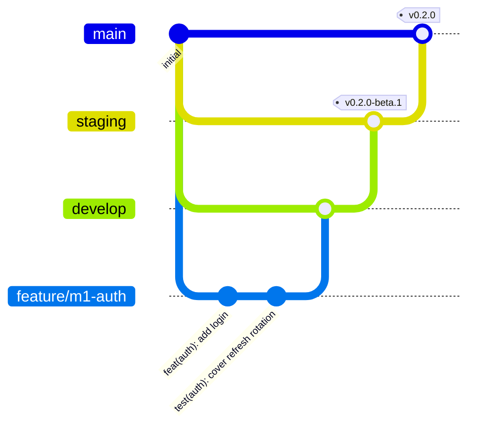

# Contributing to Cadence

Thanks for your interest in Cadence! This guide explains how the repository is organized, how changes move from an idea to production, and the conventions every change follows.

Cadence is a personal flagship project, but issues, ideas and pull requests are welcome. For anything bigger than a small fix, please **open an issue first** so we can agree on the approach.

## Repository layout

Cadence is a **monorepo**: backend, frontend, tests, load tests, deployment files and documentation all live here and are versioned together.

| Path | Contents |
|---|---|
| `src/` | ASP.NET Core backend (Clean Architecture projects) |
| `tests/` | Backend unit, integration, architecture and benchmark projects |
| `web/` | React + TypeScript frontend |
| `perf/` | k6 load test scenarios |
| `deploy/` | Production Docker Compose file, Caddyfile, PostgreSQL configuration |
| `docs/` | Roadmap, architecture decision records, architecture, performance and deployment docs |
| `.github/` | CI workflows, pull request template |

## Branching model

Three long-lived branches represent three environments. **None of them accept direct commits**: every change reaches them through a pull request.

| Branch | Environment | Receives pull requests from | Tags |
|---|---|---|---|
| `develop` | Integration. The latest completed work | `feature/*`, `fix/*`, `perf/*`, `docs/*`, `chore/*`, `hotfix/*` | none |
| `staging` | Beta testing. A release candidate | `develop`, `hotfix/*` | `vX.Y.Z-beta.N` |
| `main` | Production. What runs on real servers | `staging`, `hotfix/*` | `vX.Y.Z` |



The **Branch policy** workflow enforces the promotion path. A pull request into `staging` or `main` from any other branch fails that required check.

### Day-to-day workflow

1. Branch from `develop`, using a prefix that matches the change type:
   `feature/m3-kanban-board`, `fix/board-rank-collision`, `perf/issue-list-indexes`, `docs/adr-0009-job-queue`.
2. Commit in small, focused steps (see [Commit messages](#commit-messages)).
3. Open a pull request into `develop` and fill in the template. CI must pass.
4. Merge with a **merge commit**. This keeps each branch's individual commits and records where the feature was integrated.

### Releases

1. When a milestone is complete on `develop`, open a pull request **`develop → staging`**.
2. After merging, tag the beta release (`v0.4.0-beta.1`). It is deployed to a test environment and checked with the end-to-end and load test suites. Fixes go through `develop` and are promoted again as `-beta.2`, `-beta.3` and so on.
3. When the beta is good, open a pull request **`staging → main`**, merge it, and tag the release (`v0.4.0`). Tagging publishes the Docker images to GitHub Container Registry.

### Hotfixes

For an urgent production fix:
1. Branch `hotfix/<description>` from `main`.
2. Open a pull request into `main`.
3. Open a second pull request from the **same branch** into `develop`, so the fix is not lost. It reaches `staging` with the next promotion.

### Merge rules

- Only **merge commits** are allowed. Squash and rebase merges are disabled because they rewrite commits, which would make the three branches' histories diverge.
- Force-pushes and branch deletion are blocked on `develop`, `staging` and `main`.
- All required CI checks must pass before merging.

## Commit messages

Commits follow [Conventional Commits](https://www.conventionalcommits.org/):

```
<type>(<scope>): <summary in the imperative mood>

<body: why the change was made and anything non-obvious about how>
```

| Type | Use for |
|---|---|
| `feat` | A new user-facing capability |
| `fix` | A bug fix |
| `perf` | A performance improvement, ideally with measurements in the body |
| `refactor` | A code change that neither fixes a bug nor adds a feature |
| `test` | Adding or improving tests |
| `docs` | Documentation only |
| `build` | Build system, dependencies, Docker |
| `ci` | CI configuration |
| `chore` | Maintenance that doesn't fit elsewhere |

Scopes name the area touched: `auth`, `orgs`, `issues`, `board`, `sprints`, `search`, `realtime`, `jobs`, `reports`, `web`, `api`, `db`, `deploy` and so on.

Each commit should build and pass tests on its own. Pull request titles follow the same format.

## Code standards

- **Backend:** nullable reference types on, warnings treated as errors, .NET analyzers, and `dotnet format` clean.
- **Frontend:** strict TypeScript, ESLint (including feature-boundary rules) and Prettier.
- **Tests:** new behavior comes with tests at the right level. API endpoints also have a query-count budget.
- **Performance:** Cadence targets small servers. Check your change against the budgets in [docs/ROADMAP.md §3](docs/ROADMAP.md#3-performance-targets).
- **Architecture decisions:** anything significant gets an ADR in `docs/adr/`.

## License

By contributing, you agree that your contributions are licensed under the [MIT License](LICENSE).
