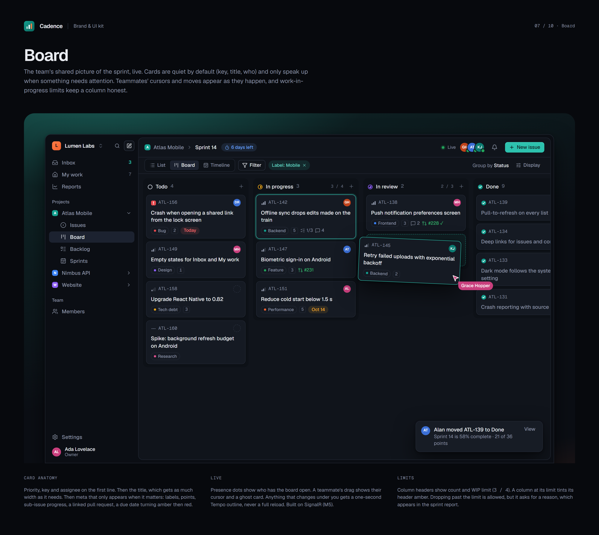
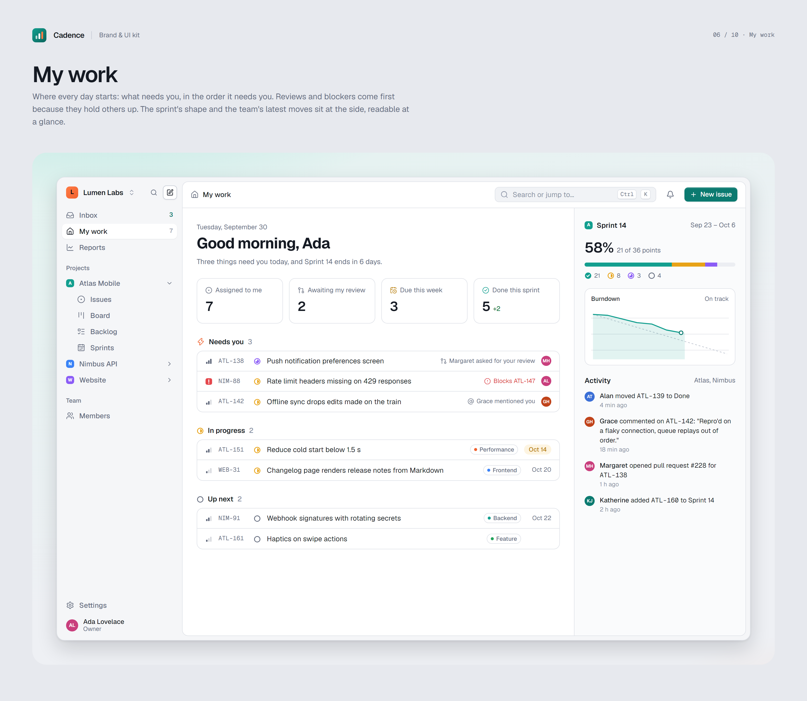
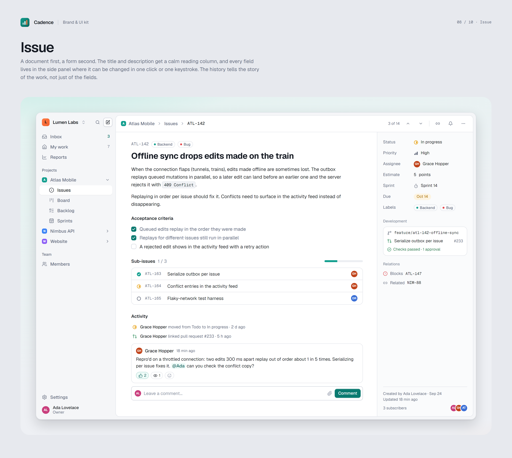
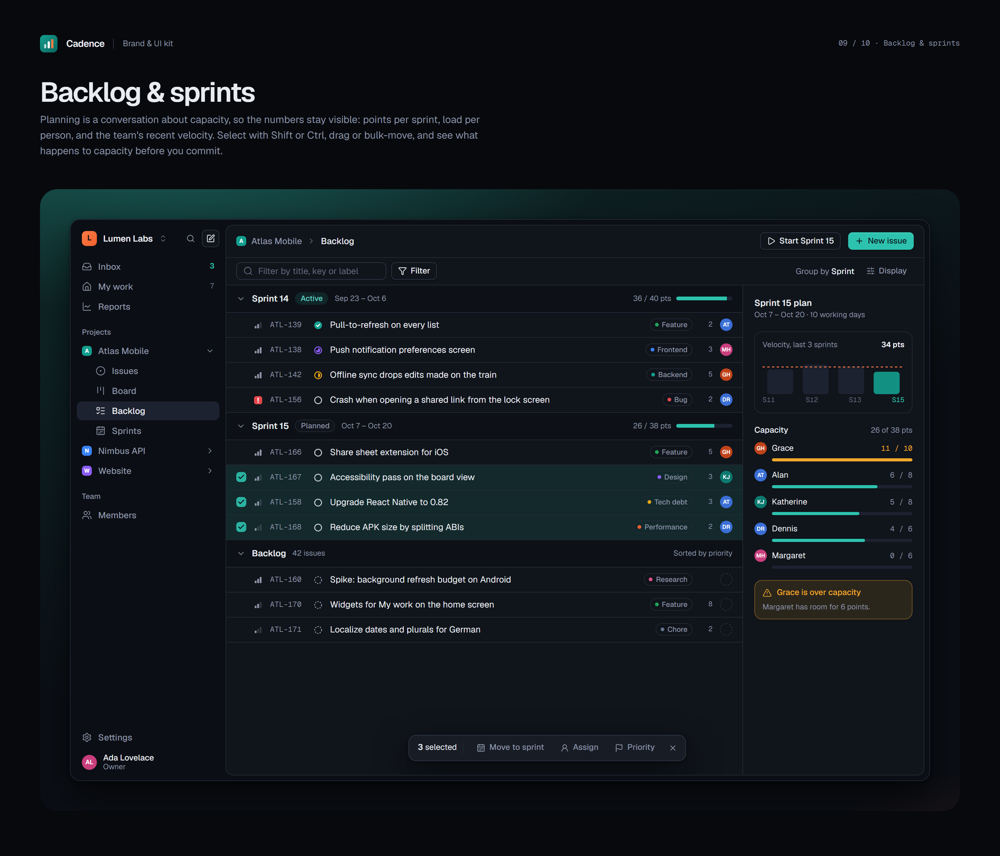
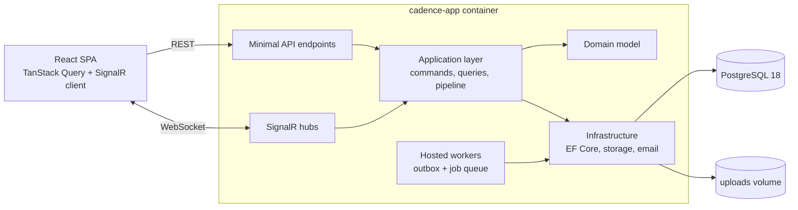

<div align="center">


# Cadence

**Project and work management for teams, built to run fast on small hardware.**

Organize work into projects, move issues through custom workflows, plan sprints, and collaborate on a real-time Kanban board. The whole system is self-hosted and fits on a 1 GB server.


[](https://github.com/norman135/cadence/actions/workflows/ci.yml)
[](LICENSE)

[Features](#features) · [Design](#design) · [Architecture](#architecture) · [Performance](#performance) · [Getting started](#getting-started) · [Roadmap](#roadmap) · [Docs](#documentation)

</div>

<p align="center"></p>

---

> [!NOTE]
> **Cadence is under active development.** It is built milestone by milestone, in the open, and each milestone ships as a tagged release. **M1 (Identity & tenancy) is complete**: people can sign up, create organizations, invite their team and manage roles, on top of the M0 foundation (architecture, CI/CD, container deployment and performance harness). **M2 (Brand & design system) is complete**: Cadence has its own identity, light and dark themes, and a design system the whole app is built on. Projects and issues arrive in M3. The [roadmap](docs/ROADMAP.md) has the full plan and current progress.

## Why Cadence?

Most project management tools assume cloud-scale infrastructure. Cadence assumes a single small server and still delivers what teams expect: live boards, full-text search, email notifications, and reporting.

- **🏢 Enterprise architecture.** Clean Architecture, CQRS, domain-driven design, multi-tenant organizations, and authorization based on permissions rather than roles alone.
- **⚡ Real-time by default.** Board moves, comments, and presence appear instantly for everyone, over SignalR.
- **🪶 Frugal with resources.** The entire stack targets under 450 MB of RAM at idle and runs on ARM64 or x86-64. See [Performance](#performance).
- **🐳 Self-hosted in minutes.** One `docker compose up`: automatic HTTPS, database migrations, and health checks included.
- **✅ Tested at every level.** Unit, integration (against real PostgreSQL), architecture, end-to-end, and load tests all run in CI.

## Features

| Area | What you get |
|---|---|
| **Organizations** | Multi-tenant workspaces, email invitations, Owner / Admin / Member / Guest roles |
| **Projects** | Project keys (`CAD-142`), project-level roles, archiving |
| **Issues** | Epics, stories, tasks and bugs, with sub-tasks, priorities, labels, estimates, due dates and issue links |
| **Workflows** | Custom statuses and transitions per project, with rules for who can move what |
| **Boards** | Drag-and-drop Kanban, swimlanes, quick filters, WIP limits |
| **Sprints** | Backlog grooming, sprint planning, carry-over, burndown charts |
| **Collaboration** | Rich-text comments, @mentions, reactions, attachments, watchers, activity feeds |
| **Real-time** | Live boards, presence, typing indicators, in-app notifications |
| **Search** | Full-text search across issues and comments, a ⌘K command palette, saved filters |
| **Reporting** | Velocity, cycle and lead time, cumulative flow, workload, org dashboards |
| **Admin** | Audit log, signed outgoing webhooks, scoped API keys, email notification preferences |

## Design

Cadence has its own brand and design system: a teal-and-ember identity, Geist type, and light and dark themes designed as equals. The tokens, component kit and product screens live in [`design/`](design/README.md) and are rendered from code, so the designs are reviewed like everything else.

| | | |
|---|---|---|
| [](design/exports/06-home.png) | [](design/exports/08-issue.png) | [](design/exports/09-backlog.png) |
| My work | Issue | Backlog & sprints |

## Tech stack

| Layer | Technologies |
|---|---|
| **Backend** | .NET 10, ASP.NET Core Minimal APIs, EF Core 10 + Npgsql, ASP.NET Core Identity + JWT, SignalR (MessagePack), Mediator (source-generated), Mapperly, FluentValidation, HybridCache, OpenTelemetry |
| **Frontend** | React 19, TypeScript (strict), Vite, React Router, TanStack Query, TanStack Virtual, Zustand, Tailwind CSS v4, shadcn/ui, dnd-kit, Tiptap, Recharts, react-hook-form + zod, Orval (typed API client generated from OpenAPI) |
| **Data** | PostgreSQL 18 for relational data, full-text search (`tsvector` + GIN), and a job queue (`SKIP LOCKED` + `LISTEN/NOTIFY`) |
| **Testing** | xUnit, Testcontainers, NetArchTest, BenchmarkDotNet, Vitest, Testing Library, MSW, Playwright, k6 |
| **Delivery** | Docker (multi-arch), Docker Compose, Caddy, GitHub Actions, GitHub Container Registry, .NET Aspire for local development |

## Architecture

Cadence is a **modular monolith** built on Clean Architecture and deployed as a **single application container**. ASP.NET Core serves the REST API, the SignalR hubs, and the pre-built React app from one origin.



| Project | Responsibility |
|---|---|
| `Cadence.Domain` | Entities, aggregates, value objects and domain events. No outside dependencies. |
| `Cadence.Application` | Use cases as commands and queries, validation, authorization, and the pipeline behaviors that wrap them |
| `Cadence.Infrastructure` | Persistence, identity, file storage, email, caching, the job queue and the outbox |
| `Cadence.Api` | HTTP endpoints, SignalR hubs, authentication, OpenAPI, and hosting the SPA |
| `web/` | React application, organized by feature |

Architecture tests in CI enforce the dependency rules between layers. Significant decisions are recorded as ADRs in `docs/adr/`.

The repository is a **monorepo**: backend, frontend, tests, load tests, deployment files and docs are versioned together, so every release is one consistent snapshot of the whole system.

<details>
<summary><strong>Repository layout</strong></summary>

```
src/
  Cadence.Domain/           Domain model
  Cadence.Application/      Use cases (CQRS)
  Cadence.Infrastructure/   EF Core, Identity, storage, email, jobs
  Cadence.Api/              Endpoints, hubs, auth, SPA hosting
  Cadence.Migrator/         EF Core migration bundle
  Cadence.AppHost/          .NET Aspire orchestration (development)
  Cadence.ServiceDefaults/  Telemetry, health checks, resilience
tests/                      Unit, integration, architecture and benchmark projects
web/                        React + TypeScript frontend
perf/k6/                    Load test scenarios
deploy/                     Production Compose file, Caddyfile, PostgreSQL config
docs/                       Roadmap, ADRs, architecture, performance, deployment
```

</details>

## Performance

Cadence is designed for a **1–2 GB RAM server with about 10 concurrent users**, and verified at 5× that load. These targets are enforced in CI and are release gates for v1.0:

| Metric | Target |
|---|---|
| App container memory (10 active users) | ≤ 200 MB |
| Whole stack at idle (proxy + app + database) | ≤ 450 MB |
| API p95 latency, 10 users | ≤ 100 ms reads · ≤ 200 ms writes |
| API p95 latency, 50 users | ≤ 300 ms, 0% errors |
| Real-time update delay between clients | ≤ 150 ms p95 |
| Initial JavaScript bundle | ≤ 180 KB gzipped |

Some of the techniques used:
- Queries that read without change tracking and project straight into DTOs, plus compiled queries and a compiled model.
- Pagination by cursor (keyset) instead of offsets.
- Fractional ranking, so moving a card is a single-row update.
- An in-process cache with stampede protection.
- Diff-based SignalR events that patch the client cache directly.
- A job queue that sleeps until PostgreSQL notifies it, instead of polling.
- Code splitting by route, and virtualized lists.

The full playbook is in the [roadmap](docs/ROADMAP.md#8-performance-engineering-playbook). Measured results will be published for every release in `docs/performance.md`.

## Getting started

### Prerequisites

- [.NET 10 SDK](https://dotnet.microsoft.com/download)
- [Node.js 22+](https://nodejs.org/)
- [Docker](https://www.docker.com/) (Docker Desktop on Windows and macOS)

### Run locally

```bash
git clone https://github.com/norman135/cadence.git
cd cadence
dotnet run --project src/Cadence.AppHost
```

Aspire starts PostgreSQL, Mailpit (to catch outgoing email), the database migrator, the API and the Vite dev server with hot reload. It also opens a dashboard with logs, traces and metrics for all of them; the app's URL is listed there as the `web` resource.

The first run installs the frontend's npm packages and pulls the container images, so it takes a few minutes.

### Self-host with Docker

```bash
cd deploy
cp .env.example .env    # set your domain, database password, JWT signing key and SMTP settings
docker compose up -d
```

Caddy gets an HTTPS certificate automatically. A one-shot container applies database migrations before the app starts. Upgrades are `docker compose pull && docker compose up -d`.

To try the production stack on your own machine, built from source instead of pulled from the registry:

```bash
cd deploy
export POSTGRES_PASSWORD=local-test JWT_SIGNING_KEY=local-test-signing-key-at-least-32-characters
docker compose -f docker-compose.yml -f docker-compose.build.yml -f docker-compose.e2e.yml up -d --build
```

Then open https://localhost (Caddy uses a self-signed certificate for `localhost`). The `docker-compose.e2e.yml` override adds [Mailpit](https://mailpit.axllent.org/), so confirmation and invitation emails appear at http://localhost:8025 instead of needing a real mail server.

### Run the tests

```bash
dotnet test                       # unit, integration and architecture tests (needs Docker)
cd web && npm test                # frontend unit and component tests
cd web && npm run e2e             # Playwright end-to-end tests (needs the stack above running)
cd web && npm run test:visual     # screenshots and accessibility of key pages (Linux; see docs)
```

Load tests, memory checks and benchmarks are described in [docs/performance.md](docs/performance.md).

## Roadmap

| Milestone | Release | Status |
|---|---|---|
| M0: Foundation | `v0.1.0` | ✅ Done |
| M1: Identity & tenancy | `v0.2.0` | ✅ Done |
| M2: Brand & design system | `v0.3.0` | ✅ Done |
| M3: Projects & issues | `v0.4.0` | Planned |
| M4: Workflows & Kanban board | `v0.5.0` | Planned |
| M5: Real-time collaboration | `v0.6.0` | Planned |
| M6: Sprints & planning | `v0.7.0` | Planned |
| M7: Rich collaboration & search | `v0.8.0` | Planned |
| M8: Background processing & integrations | `v0.9.0` | Planned |
| M9: Reporting & dashboards | `v0.10.0` | Planned |
| M10: Hardening & release | `v1.0.0` | Planned |

Each milestone's detailed scope and completion criteria are in [docs/ROADMAP.md](docs/ROADMAP.md).

## Documentation

| Document | Contents |
|---|---|
| [Roadmap](docs/ROADMAP.md) | Constraints, architecture, technology choices, performance playbook, milestones |
| [Contributing guide](CONTRIBUTING.md) | Branching model, pull request workflow, commit conventions |
| [Agent guide](AGENTS.md) | Commands, conventions and constraints for AI coding agents |
| [Architecture overview](docs/architecture.md) | Layers, request flow, frontend structure, build and delivery |
| [Architecture decision records](docs/adr/README.md) | The reasoning behind each significant decision |
| [Design system](design/README.md) | Brand, tokens, components and screen designs |
| [Performance report](docs/performance.md) | Measured results for each release, and how to reproduce them |
| [Changelog](CHANGELOG.md) | What changed in each release |
| Deployment runbook (`docs/deployment.md`) | Install, upgrade, backup and restore *(M10)* |

## Development workflow

Changes flow through three protected branches. Nothing is committed to them directly; every change arrives through a pull request.

```
feature/*  ──PR──▶  develop  ──PR──▶  staging  ──PR──▶  main
                  integration       beta testing      production
                                    vX.Y.Z-beta.N     vX.Y.Z
```

- **Commits** follow [Conventional Commits](https://www.conventionalcommits.org/) (`feat(board): …`, `perf(issues): …`). Each commit does one thing and has a body explaining *why* when that isn't obvious.
- **Releases:** each milestone is promoted to `staging` as a beta, then to `main` as a [Semantic Version](https://semver.org/) release. Changes are recorded in `CHANGELOG.md`.

The full workflow, including hotfixes and merge rules, is in the [contributing guide](CONTRIBUTING.md).

## License

Cadence is released under the [MIT License](LICENSE). You're free to use, modify and distribute the code, including in commercial projects. The license requires that you **keep the copyright notice and license text** in any copy or substantial portion of the code, and that notice is the credit. A link back to this repository is appreciated too.

© 2026 Norman Mico ([@norman135](https://github.com/norman135))
