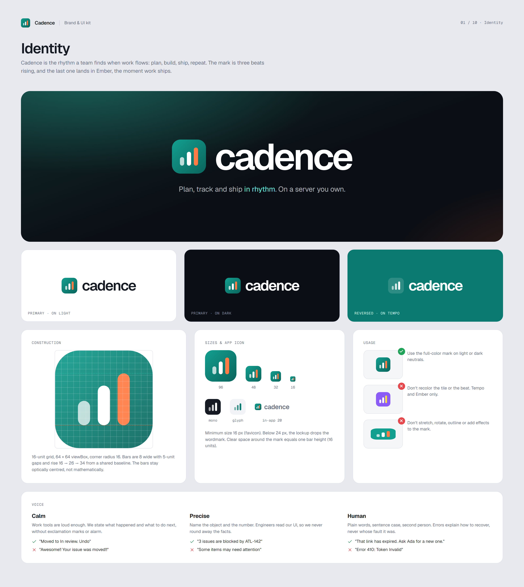
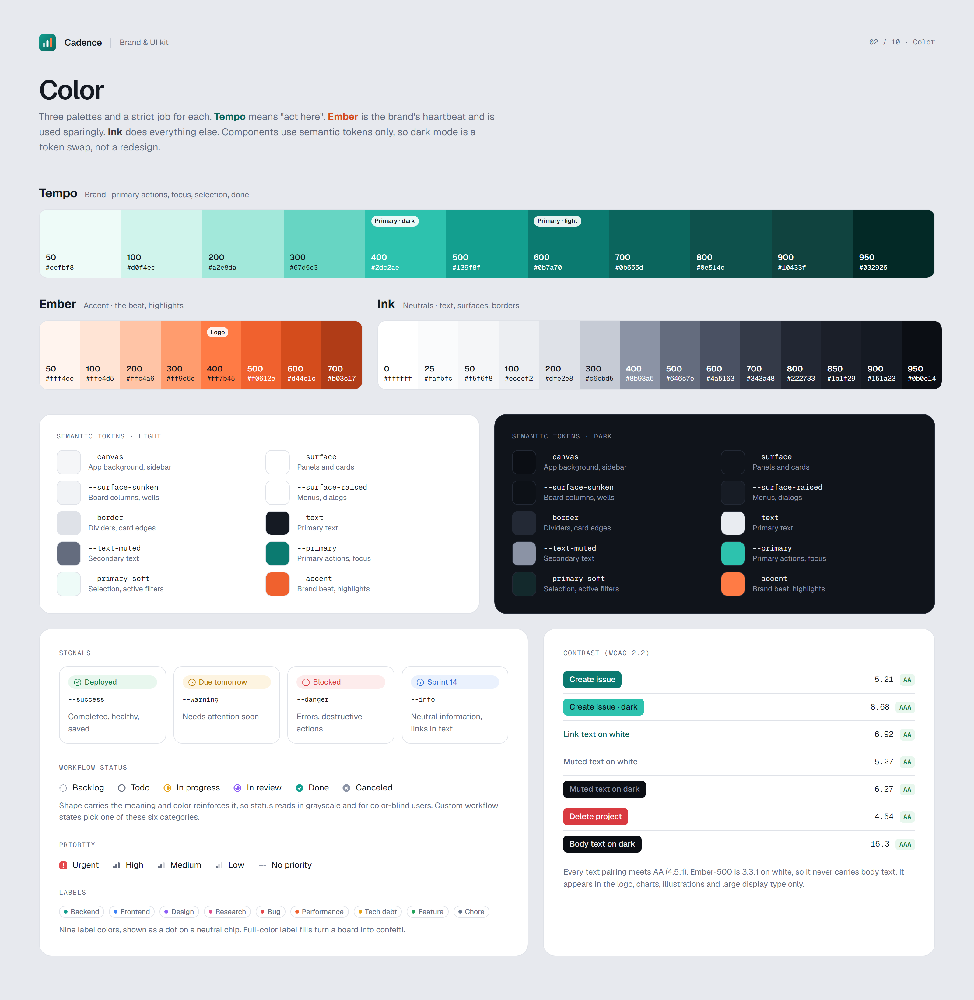
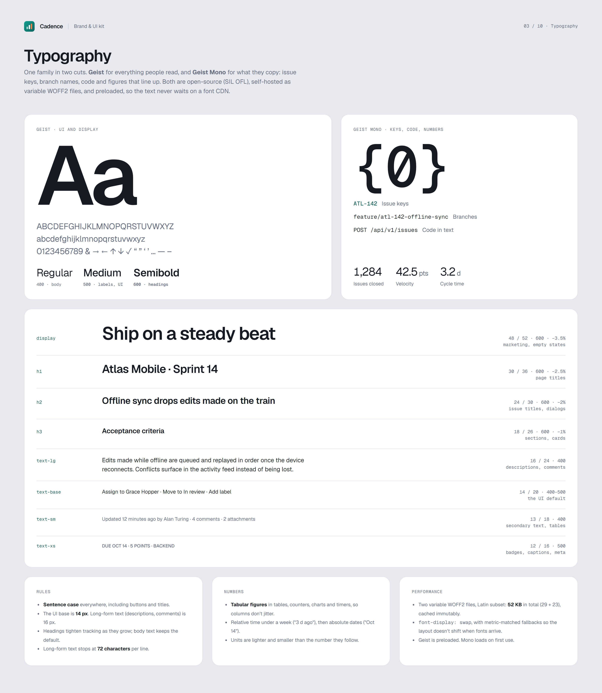
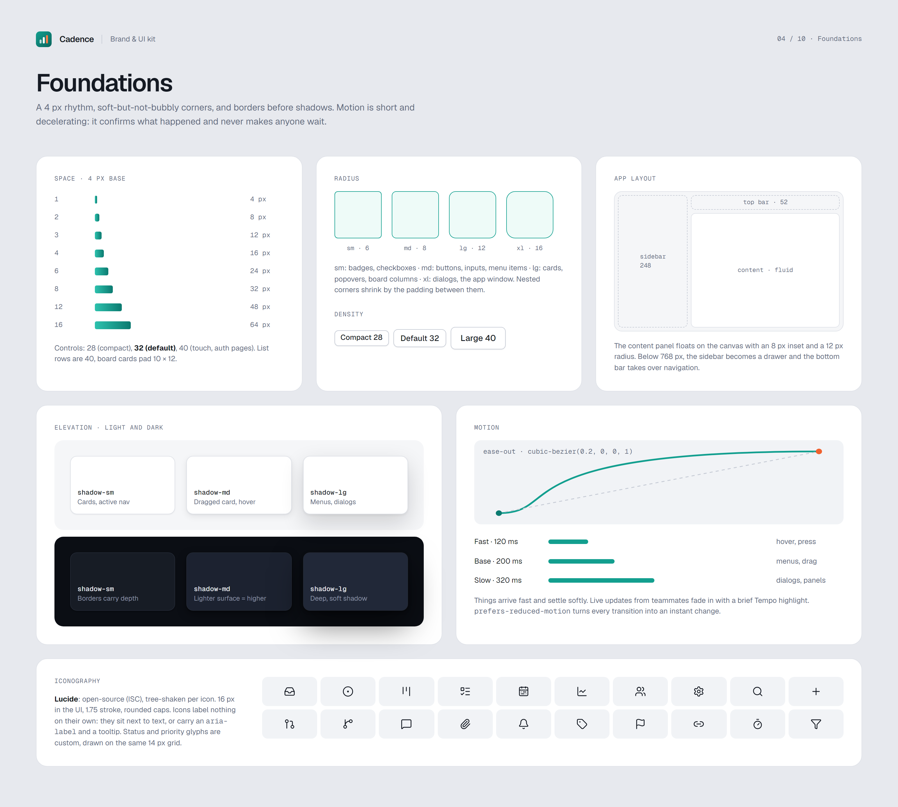
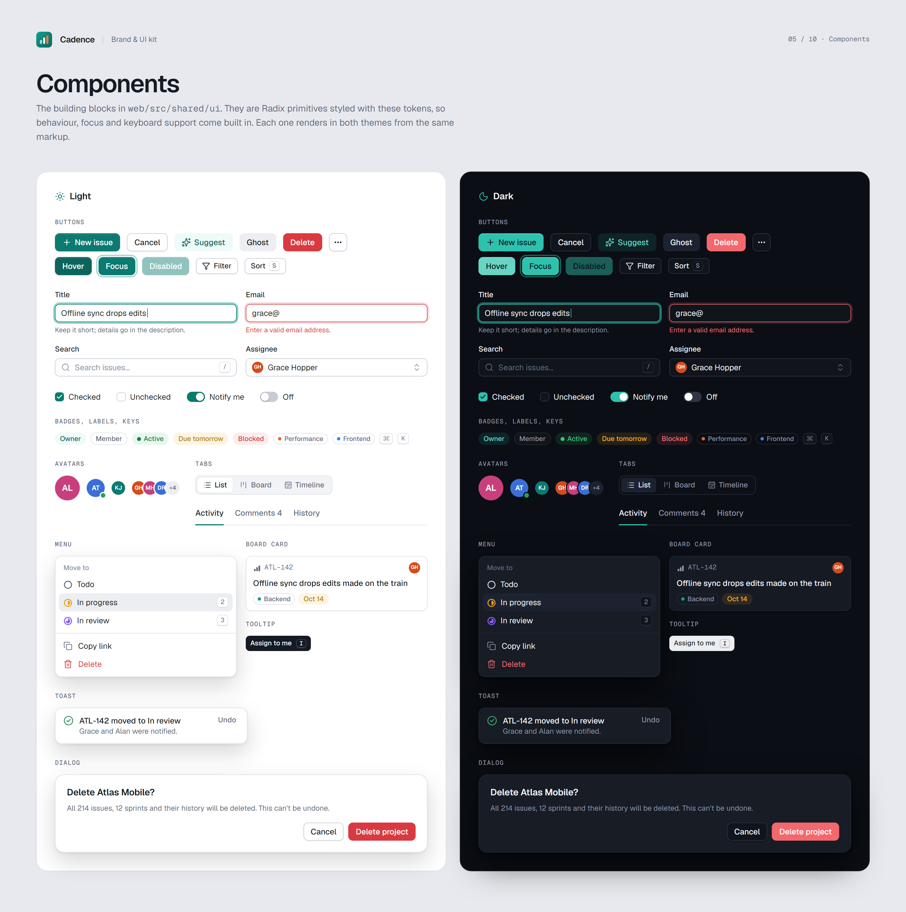
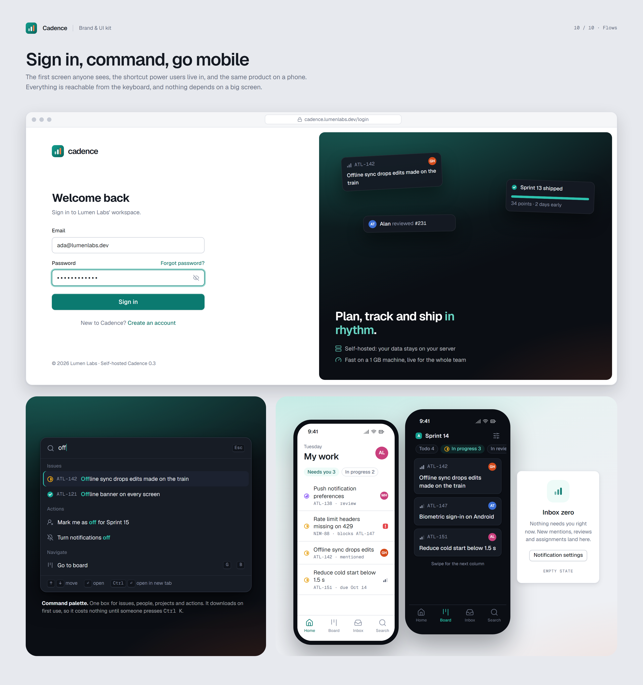

# Cadence design system

The brand and UI kit for Cadence: identity, tokens, components and the key product screens. The web app is built to match these boards, and new screens are designed here first. The reasoning behind the choices is in [ADR-0016](../docs/adr/0016-brand-and-design-system.md).

| Path | What it is |
|---|---|
| [`tokens.css`](tokens.css) | **The source of truth** for color, type, space, radius, elevation and motion |
| [`logo/`](logo) | The mark (full color, mono, glyph) as SVG |
| [`boards/`](boards) | The design boards: HTML built from the tokens |
| [`exports/`](exports) | The boards rendered to PNG at 2× |
| [`render.mjs`](render.mjs) | Re-renders the boards |

## The boards

| | |
|---|---|
| **01 · Identity**: mark, lockups, construction, usage, voice | **02 · Color**: Tempo, Ember and Ink; semantic tokens in both themes; status, priority, labels; contrast |
| [](exports/01-brand.png) | [](exports/02-color.png) |
| **03 · Typography**: Geist and Geist Mono, the type scale, numbers | **04 · Foundations**: space, radius, elevation, motion, icons, layout |
| [](exports/03-typography.png) | [](exports/04-foundations.png) |
| **05 · Components**: the `shared/ui` kit in light and dark | **06 · My work**: the daily starting point |
| [](exports/05-components.png) | [](exports/06-home.png) |
| **07 · Board**: the live Kanban board | **08 · Issue**: document first, fields at the side |
| [](exports/07-board.png) | [](exports/08-issue.png) |
| **09 · Backlog & sprints**: capacity-aware planning | **10 · Flows**: sign-in, command palette, mobile, empty states |
| [](exports/09-backlog.png) | [](exports/10-flows.png) |

## Principles

1. **Calm by default, loud on purpose.** Neutral surfaces and quiet cards. Color is spent on what needs attention: an action, a blocker, a due date turning red.
2. **Dense but breathable.** The UI base is 14 px on a 4 px grid, because work tools hold a lot of information. Long-form text gets 16 px and a 72-character line.
3. **Keyboard first.** Every action has a menu entry, most have a shortcut, and `Ctrl K` reaches everything.
4. **Meaning never rides on color alone.** Status and priority glyphs differ in shape, and every text pairing meets WCAG AA in both themes.
5. **Live, not loud.** Teammates' changes fade in with a brief Tempo outline. Nothing reloads under your cursor.
6. **Light and dark are equals.** Both themes are designed, not derived. Components use semantic tokens only.

## Brand at a glance

| | Light | Dark |
|---|---|---|
| Primary (Tempo) | `#0b7a70` (600) | `#2dc2ae` (400) |
| Accent (Ember) | `#f0612e` (500) | `#ff7b45` (400) |
| Canvas | `#f5f6f8` | `#0b0e14` |
| Surface | `#ffffff` | `#10141b` |
| Text | `#151a23` | `#e9ecf1` |
| Muted text | `#646c7e` | `#8b93a5` |

- **Type:** [Geist and Geist Mono](https://vercel.com/font) (SIL OFL). UI 14/20, long-form 16/24, headings semibold with tighter tracking.
- **Icons:** [Lucide](https://lucide.dev) (ISC), 16 px, 1.75 stroke.
- **Radius:** 6 · 8 · 12 · 16. **Motion:** 120 / 200 / 320 ms, `cubic-bezier(0.2, 0, 0, 1)`.

## Editing and rendering

Boards are plain HTML that use `boards/board.css` (the tokens plus the component styles) and `boards/board.js`, which draws the status and priority glyphs and avatars. Product screens share their sidebar through `boards/screens.js`.

```bash
cd web && npx playwright install chromium   # once
node ../design/render.mjs                   # every board
node ../design/render.mjs 07                # only boards whose file name contains "07"
```

Rendering loads Geist from Google Fonts and Lucide from jsDelivr, so it needs internet access. The web app itself self-hosts both and never calls a CDN.

The people in the mockups are computing pioneers, and Lumen Labs is a fictional company.
