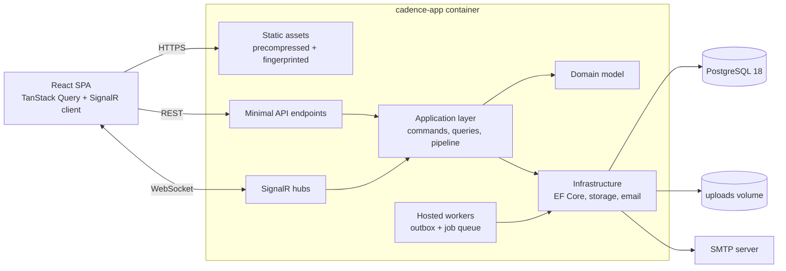
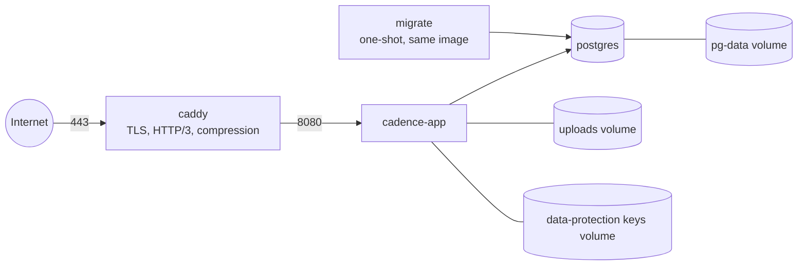

# Cadence — Project Roadmap

> The working plan for building **Cadence**, a multi-tenant project and work management platform built with ASP.NET Core and React + TypeScript.
> It is updated as milestones are completed. Checkboxes track progress.

| | |
|---|---|
| **Status** | In development: M0 complete |
| **Last updated** | 2026-09-23 |
| **Current milestone** | M1: Identity & tenancy (not started) |

---

## Contents

1. [Vision](#1-vision)
2. [Hard constraints](#2-hard-constraints)
3. [Performance targets](#3-performance-targets)
4. [Feature scope](#4-feature-scope)
5. [Architecture](#5-architecture)
6. [Technology stack](#6-technology-stack)
7. [Architecture decisions](#7-architecture-decisions)
8. [Performance engineering playbook](#8-performance-engineering-playbook)
9. [Deployment](#9-deployment)
10. [Milestones](#10-milestones)
11. [Engineering conventions](#11-engineering-conventions)
12. [Prerequisites and open items](#12-prerequisites-and-open-items)
13. [Plan history](#13-plan-history)

---

## 1. Vision

Cadence is a Jira- or Linear-style work management platform. Teams organize work into projects, track issues through custom workflows, plan sprints, and collaborate in real time on a shared Kanban board.

It is a portfolio flagship. Its purpose is to show senior-level work on the .NET + React stack:

- **Enterprise architecture.** Clean Architecture, CQRS, domain-driven design, multi-tenancy, and permission-based security.
- **Real-time collaboration.** SignalR with live boards, presence, and notifications.
- **Serious performance engineering.** The whole system runs comfortably on a small, low-RAM ARM or x86 server.
- **Professional delivery.** Automated tests at every level, CI/CD, containerized self-hosting, and a readable public git history.

---

## 2. Hard constraints

These are not negotiable. Every design decision must satisfy them.

| Constraint | Requirement |
|---|---|
| **Hosting** | Self-hosted with Docker Compose on the owner's server. No cloud-managed services. |
| **CPU architecture** | Must run on **linux/arm64 and linux/amd64**. Every image in the stack is multi-arch. |
| **Memory** | The full stack must run on a **1 GB RAM host** and be comfortable on 2 GB. |
| **Load** | About **10 concurrent active users**, with **5× headroom (50 users)** verified by load tests. |
| **Database** | **PostgreSQL 18.** SQL Server was rejected because it has no ARM64 images. |
| **Source** | Public GitHub **monorepo** ([norman135/cadence](https://github.com/norman135/cadence)) holding backend, frontend, tests and deployment files. The commit history must be readable and well documented. |
| **Workflow** | Three protected branches (`develop` → `staging` → `main`). **No direct commits**: every change goes through a pull request. See [§11](#branching-and-releases). |

---

## 3. Performance targets

These targets are measured from M0 onward and are **release gates** in M9. Results are recorded in `docs/performance.md` for each release.

| Metric | Target | Measured with |
|---|---|---|
| App container memory, steady state at 10 users | **≤ 200 MB** RSS (hard limit 320 MB) | `docker stats` during a k6 run |
| PostgreSQL container memory | **≤ 300 MB** (hard limit 384 MB) | `docker stats` |
| Whole stack at idle | **≤ 450 MB** | `docker stats` |
| API p95 latency at 10 users | reads **≤ 100 ms**, writes **≤ 200 ms** | k6 |
| API p95 latency at 50 users | **≤ 300 ms**, 0% errors | k6 |
| Real-time delay (board move reaching other clients) | **≤ 150 ms** p95 on LAN | Playwright two-client probe |
| Cold start until healthy | **≤ 5 s** on 2 vCPU ARM64 | health check timing |
| Initial JS bundle | **≤ 180 KB** gzipped | bundle budget script in CI |
| Largest route chunk | **≤ 80 KB** gzipped | bundle budget script in CI |
| Lighthouse performance score (desktop) | **≥ 90** | Lighthouse CI |
| DB round-trips for a typical endpoint | **≤ 3**, no N+1 queries | query-count assertions in integration tests |

---

## 4. Feature scope

| Area | Features |
|---|---|
| **Organizations** | Multi-tenant workspaces, email invitations, org roles (Owner / Admin / Member / Guest) |
| **Projects** | Project keys such as `CAD-142`, project-level roles, archiving |
| **Issues** | Types (Epic / Story / Task / Bug), sub-tasks, priority, assignee, labels, estimates, due dates, issue links, rich-text descriptions |
| **Workflows** | Custom statuses and transitions per project, with transition rules |
| **Boards** | Kanban board with drag-and-drop ordering, swimlanes, quick filters, WIP limits |
| **Sprints** | Backlog, sprint planning, starting and completing sprints, carry-over |
| **Collaboration** | Comments, @mentions, reactions, attachments, activity feed, watchers |
| **Real-time** | Live board updates, presence, typing indicators, in-app notifications |
| **Search** | Full-text search across issues and comments, command palette, saved filters |
| **Reporting** | Burndown, velocity, cycle and lead time, cumulative flow, workload, org dashboard |
| **Admin** | Audit log, outgoing webhooks, API keys, tenant settings, notification preferences |

---

## 5. Architecture

A **modular monolith** built on Clean Architecture and deployed as **one application container**. The ASP.NET Core app serves the API, the SignalR hubs, and the pre-built React SPA from a single origin. There is no separate web server and no CORS.



### Backend solution layout

```
src/
  Cadence.Domain/           Entities, aggregates, value objects, domain events. No dependencies.
  Cadence.Application/      Commands and queries, handlers, validators, DTOs, abstractions, pipeline behaviors
  Cadence.Infrastructure/   EF Core + Npgsql, Identity, file storage, email, job queue, outbox, caching
  Cadence.Api/              Minimal API endpoints, SignalR hubs, auth, OpenAPI, middleware, SPA hosting
  Cadence.Migrator/         One-shot console app that applies migrations, then exits (ADR-0015)
  Cadence.AppHost/          .NET Aspire orchestration (development only, not shipped)
  Cadence.ServiceDefaults/  OpenTelemetry, health checks, resilience defaults
tests/
  Cadence.Domain.UnitTests/
  Cadence.Application.UnitTests/
  Cadence.Api.IntegrationTests/   WebApplicationFactory + Testcontainers PostgreSQL
  Cadence.ArchitectureTests/      Enforces layer dependency rules
  Cadence.Benchmarks/             BenchmarkDotNet for hot paths
web/                              React application
perf/k6/                          Load test scenarios
deploy/                           Production Compose file, Caddyfile, postgresql.conf, .env.example
docs/                             Roadmap, ADRs, architecture, performance, deployment runbook
```

### Frontend layout (organized by feature)

```
web/src/
  app/        Providers, router, layouts, error boundaries
  features/   auth, organizations, projects, issues, board, sprints, search, reports, notifications, admin
  shared/     ui (shadcn components), hooks, lib, realtime client, api (generated by Orval)
```

Each feature owns its routes, components, hooks and query keys. Features import only from `shared/`, never from each other. ESLint enforces this rule.

---

## 6. Technology stack

| Concern | Choice | Why |
|---|---|---|
| Runtime | **.NET 10 (LTS), C# 14** | Current LTS; strong performance in low-memory containers |
| Web | **ASP.NET Core Minimal APIs** + API versioning | Lower overhead than MVC controllers; typed results |
| Mediator | **Mediator** (source-generated) | No reflection, fewer allocations. MediatR moved to commercial licensing in 2025 |
| Mapping | **Mapperly** (source-generated) | Mapping code generated at compile time, no runtime cost. Replaces AutoMapper |
| Validation | **FluentValidation** | Runs inside the mediator pipeline |
| ORM | **EF Core 10 + Npgsql** | First-class PostgreSQL provider with compiled models and compiled queries |
| Database | **PostgreSQL 18 (Alpine)** | ARM64 support, small footprint, built-in full-text search, `SKIP LOCKED`, `LISTEN/NOTIFY` |
| Auth | **ASP.NET Core Identity + JWT** access tokens + rotating refresh tokens | Industry-standard pattern. Refresh tokens live in httpOnly cookies |
| Real-time | **SignalR** with the MessagePack protocol | Compact binary payloads; single node, no backplane |
| Caching | **HybridCache**, in-process only, size-capped | Stampede protection and tag-based invalidation, with no Redis |
| Background work | **Custom PostgreSQL job queue** + transactional outbox | Near-zero idle cost; no Hangfire overhead (see ADR-0009) |
| Email | **MailKit** over SMTP; Mailpit in development | Works with any SMTP provider |
| Logging and telemetry | Built-in `ILogger` with `LoggerMessage` source generation, JSON console output, OpenTelemetry | Low-allocation logging. OTLP export is optional and off by default in production |
| Frontend | **React 19, TypeScript (strict), Vite** | Modern, fast builds |
| Routing | **React Router** with lazy routes | Code splitting by route |
| Server state | **TanStack Query** | Caching and optimistic updates; real-time events patch the cache |
| Client state | **Zustand** | Small; selectors avoid unnecessary re-renders |
| UI | **Tailwind CSS v4 + shadcn/ui (Radix)** | Accessible components; CSS shipped only for classes used |
| Drag and drop | **dnd-kit** | Performant and accessible |
| Rich text | **Tiptap** (lazy-loaded) | Extensible editor with mention support |
| Charts | **Recharts** (lazy-loaded) | Loaded only on report routes |
| Lists | **TanStack Virtual** | Virtualized backlog, issue lists and feeds |
| Forms | **react-hook-form + zod** | Uncontrolled inputs with type-safe schemas |
| API client | **Orval**, generated from OpenAPI | Typed client and TanStack Query hooks; no hand-written fetch code |
| Rendering | **React Compiler** | Automatic memoization |
| Backend tests | **xUnit, Testcontainers, NetArchTest, BenchmarkDotNet** | Unit, integration, architecture and performance tests |
| Frontend tests | **Vitest, Testing Library, MSW, Playwright** | Unit, component and end-to-end tests |
| Local development | **.NET Aspire** | One command starts the API, PostgreSQL, Mailpit and the Vite dev server, with a telemetry dashboard |
| CI/CD | **GitHub Actions** | Build, test, lint, bundle budgets, multi-arch images to GHCR |
| Reverse proxy | **Caddy** | Automatic HTTPS, HTTP/3, compression; about 25 MB of RAM |

---

## 7. Architecture decisions

Each decision gets a full ADR in `docs/adr/` when it is implemented.

| ADR | Decision |
|---|---|
| 0001 | Record architecture decisions using lightweight ADRs |
| 0002 | Modular monolith with Clean Architecture instead of microservices, sized for a single small host |
| 0003 | PostgreSQL 18 instead of SQL Server: ARM64 support, smaller footprint, built-in full-text search |
| 0004 | Single container: ASP.NET Core serves the SPA, so there is one origin and no CORS |
| 0005 | Minimal APIs with a source-generated mediator and Mapperly; no reflection-based libraries on hot paths |
| 0006 | Short-lived JWT access tokens with rotating refresh tokens and reuse detection |
| 0007 | Tenant isolation through EF Core global query filters, with composite indexes that lead with `organization_id` |
| 0008 | No Redis in v1: in-process HybridCache and single-node SignalR, with a documented scale-out path |
| 0009 | Job queue backed by PostgreSQL (`SKIP LOCKED` + `LISTEN/NOTIFY`) instead of Hangfire |
| 0010 | Fractional indexing for board and backlog ordering, so a move updates a single row |
| 0011 | UUIDv7 primary keys (`Guid.CreateVersion7()`), which insert in order and keep B-tree indexes compact |
| 0012 | GC mode and runtime tuning for low-memory hosts, chosen by measurement |
| 0013 | Native AOT evaluation: adopt only if EF Core and SignalR support is production-ready, and record the measurements either way |
| 0014 | Commit the OpenAPI document and the generated frontend client; CI fails on drift *(added in M0)* |
| 0015 | Apply migrations in a one-shot migrator process that shares the app image *(added in M0)* |

---

## 8. Performance engineering playbook

Performance is designed in from the start, not fixed at the end. Each milestone's definition of done includes the performance budgets for its features.

### 8.1 Runtime and container

- **Chiseled, non-root ASP.NET runtime image** with `InvariantGlobalization`, so ICU is not needed. The UI handles localization.
- **ReadyToRun** compilation for faster startup and less JIT memory. Tiered PGO stays on.
- **The GC respects container limits:** .NET honors cgroup memory limits. `GCHeapHardLimitPercent` and `GCConserveMemory` are tuned, and Workstation GC is compared with Server GC + DATAS under load. The winner is recorded in ADR-0012.
- **Every service in Compose has a `mem_limit`**, including in development, so memory regressions fail loudly instead of hiding.
- **Compiled EF Core model** (`dotnet ef dbcontext optimize`) to cut startup time and model-building memory.

### 8.2 Data access (EF Core + PostgreSQL)

- **Reads never load tracked aggregates.** Queries use `AsNoTracking` and project straight into DTOs with `Select`. Only commands load tracked aggregates.
- **DbContext pooling** (`AddDbContextPool`). The Npgsql pool is capped at about 20 connections to match `max_connections`.
- **Compiled queries** (`EF.CompileAsyncQuery`) for the hottest paths: board load, issue detail, permission lookup.
- **Set-based writes** with `ExecuteUpdateAsync` / `ExecuteDeleteAsync` for bulk operations such as sprint carry-over and archiving.
- **Keyset (cursor) pagination** everywhere, with a maximum page size of 100. No `OFFSET` scans.
- **Indexes designed for each query:**
  - composite indexes that lead with `organization_id`
  - partial indexes, for example on non-archived issues only
  - GIN indexes on generated `tsvector` columns for search
  - a BRIN index on the append-only audit log
- **Optimistic concurrency with PostgreSQL's `xmin` system column**, so no extra column is needed.
- **Denormalized counters** (comment count, sub-task progress) are updated in the same transaction, so list views never run `COUNT(*)` per row.
- **`AsSplitQuery`** where a join would multiply rows (cartesian explosion).
- **Query budgets are enforced in tests.** A command interceptor counts round-trips, and integration tests fail when an endpoint exceeds its budget.
- **Slow-query visibility.** An EF interceptor logs queries slower than 50 ms, and `pg_stat_statements` is enabled.
- **PostgreSQL is tuned for a small host.** See [§9.3](#93-postgresql-tuning-small-host).

### 8.3 API layer

- **System.Text.Json source generation** for all request and response types.
- **Conditional requests.** ETags on issue detail and board reads, so an unchanged read costs a 304.
- **Output caching** for rarely changing reference data (workflows, labels, members), evicted by tag on writes.
- **HybridCache, in process only,** with a size limit of about 32 MB. It holds permission sets, workflow definitions, and project metadata. The permission check on the hot path makes no database queries.
- **Streaming I/O.**
  - Uploads are streamed to disk with `MultipartReader` and never buffered in memory.
  - Downloads use range-enabled file results.
  - CSV exports stream as `IAsyncEnumerable`.
- **Caddy handles compression** of dynamic responses, which takes that CPU work out of the app. Static assets are pre-compressed at build time.
- **Per-user rate limiting**, with stricter limits on authentication endpoints, to protect a small host.
- **Request body and form size limits** are set explicitly.

### 8.4 Real-time

- **One SignalR group per project.**
- **Events carry small diffs** (issue id, changed fields, new rank), not full objects.
- **MessagePack protocol** for smaller payloads and cheaper serialization.
- **Clients apply events directly to the TanStack Query cache** with `setQueryData`, so there are no refetch storms after a change.
- **Presence is kept in memory** (`ConcurrentDictionary` with heartbeat expiry). No database writes.
- **Version stamps on events.** After a reconnect, the client resyncs only what it missed.
- **WebSockets only**, skipping the negotiate round-trip. Buffer limits are set for each connection.

### 8.5 Background work

- **One `BackgroundService`** pulls jobs from a PostgreSQL table with `FOR UPDATE SKIP LOCKED`, with bounded concurrency through `Channel<T>`.
- **`LISTEN/NOTIFY` wakes the worker** instead of polling on a timer, so an idle worker costs almost nothing.
- **Transactional outbox:** domain events are written in the same transaction as the change, then dispatched by the same worker.
- **Retries** use exponential backoff, and failed jobs go to a dead-letter table.
- **Scheduled jobs** (reminders, digests, retention) come from a small cron table parsed with Cronos.

### 8.6 Frontend

- **Route-level code splitting.** Heavy libraries (Tiptap, Recharts) load only on the routes that use them.
- **Virtualization** (TanStack Virtual) for backlogs, issue lists and activity feeds.
- **TanStack Query tuning:**
  - `staleTime` set per query type
  - query-key factories
  - optimistic updates with rollback
- **Few re-renders:** React Compiler, Zustand selectors, memoized board cards, and stable dnd-kit sensors.
- **Build output:**
  - Brotli and gzip pre-compression.
  - Fingerprinted file names, served by `MapStaticAssets` with `Cache-Control: immutable`.
  - Icons tree-shaken; fonts from the system stack or one subset variable font.
- **Budgets enforced in CI** by `web/scripts/check-bundle-budget.mjs`, which reads Vite's manifest to measure the initial download separately from each lazy chunk.

### 8.7 Measurement and regression prevention

| Tool | Purpose |
|---|---|
| **k6** (`perf/k6/`) | Realistic user journeys at 10 and 50 users, with thresholds matching §3 |
| **BenchmarkDotNet** | Micro-benchmarks for hot paths such as rank calculation, permission evaluation and serialization |
| **Query-count assertions** | Catch N+1 queries and query-budget regressions in integration tests |
| **Bundle budget script** | Frontend bundle budgets (gzip, initial vs. lazy chunks) |
| **`perf/smoke-test.sh`, `perf/measure-memory.sh`** | End-to-end checks and per-container memory budgets |
| **Lighthouse CI** | Frontend performance score |
| **dotnet-counters, dotnet-trace, dotnet-gcdump** | Memory and CPU profiling passes |
| **React Profiler** | Render performance of board, backlog and lists |
| **`pg_stat_statements`** | Top queries by total time |

A **nightly CI job** runs a k6 smoke test (10 users) against the full Compose stack on both an **x86-64 and an ARM64 GitHub runner**.

---

## 9. Deployment

### 9.1 Topology



### 9.2 Services and memory budget

| Service | Image | `mem_limit` | Expected steady state |
|---|---|---|---|
| `caddy` | `caddy:2-alpine` | 64 MB | ~25 MB |
| `cadence-app` | `ghcr.io/norman135/cadence` (chiseled) | 320 MB | 120–200 MB |
| `postgres` | `postgres:18-alpine` | 384 MB | 150–300 MB |
| `migrate` | `ghcr.io/norman135/cadence` (migrator entrypoint) | 128 MB | Runs once, then exits |
| **Total** | | **~770 MB ceiling** | **~300–525 MB** |

### 9.3 PostgreSQL tuning (small host)

Shipped as `deploy/postgresql.conf`:

```ini
shared_buffers = 96MB
effective_cache_size = 256MB
work_mem = 4MB
maintenance_work_mem = 32MB
max_connections = 25
wal_buffers = 4MB
random_page_cost = 1.1        # assumes SSD storage
jit = off                     # small OLTP queries don't benefit; saves memory and latency
shared_preload_libraries = 'pg_stat_statements'
```

### 9.4 Production concerns

- **Migrations** run in a one-shot `migrate` container: the app image with the migrator entrypoint ([ADR-0015](adr/0015-one-shot-migrator.md)). The app never changes the schema on startup.
- **ASP.NET Data Protection keys** persist to a volume, so logins survive container restarts.
- **Configuration** comes from environment variables. `deploy/.env.example` documents every setting. No secrets are committed.
- **Health checks** at `/health/live` and `/health/ready` are wired into Compose `healthcheck` and `depends_on`.
- **Forwarded headers** are configured for Caddy, so client IPs and HTTPS detection work behind the proxy.
- **Backups:** `pg_dump` from a host cron job (no extra always-on container), plus a tarball of the uploads volume. Restore steps are documented and tested.

### 9.5 Release flow

1. **Beta:** merge the `develop → staging` pull request and tag `staging` as `vX.Y.Z-beta.N`. GitHub Actions publishes images tagged `X.Y.Z-beta.N` and `beta`, for a test deployment.
2. **Production:** merge the `staging → main` pull request and tag `main` as `vX.Y.Z`. GitHub Actions builds **multi-arch images** (`linux/amd64`, `linux/arm64`) with buildx and pushes `X.Y.Z` and `latest` to GHCR.
3. On the server: `docker compose pull && docker compose up -d`. The migrate container runs first, then the app starts.
4. To roll back, pin the previous image tag in `.env` and run `up -d` again. Migrations are written to be backward-compatible for one release.

### 9.6 Scale-out path (documented, not built)

If Cadence ever needs more than one app node:
- add Redis as the HybridCache L2 and as the SignalR backplane
- run multiple `cadence-app` replicas behind Caddy

The abstractions are already in place, so this is a configuration change rather than a rewrite. ADR-0008 records it.

---

## 10. Milestones

| # | Milestone | Tag | Headline |
|---|---|---|---|
| M0 | Foundation | `v0.1.0` | A production-shaped empty system that builds, tests, containerizes and measures itself |
| M1 | Identity & tenancy | `v0.2.0` | Accounts, organizations, invitations, permissions |
| M2 | Projects & issues | `v0.3.0` | The core work-tracking domain |
| M3 | Workflows & Kanban | `v0.4.0` | Custom workflows and a drag-and-drop board |
| M4 | Real-time collaboration | `v0.5.0` | Live boards, presence, notifications |
| M5 | Sprints & planning | `v0.6.0` | Backlog, sprint lifecycle, burndown |
| M6 | Rich collaboration & search | `v0.7.0` | Rich text, mentions, attachments, full-text search |
| M7 | Background processing | `v0.8.0` | Job queue, email, reminders, webhooks, audit log |
| M8 | Reporting & dashboards | `v0.9.0` | Velocity, cycle time, flow and workload analytics |
| M9 | Hardening & release | `v1.0.0` | Load-tested, secured, documented, shipped |

---

### M0 — Foundation · `v0.1.0` ✅

**Goal:** an empty system that is already shaped like production. It builds, tests, packages into containers, deploys and measures itself before any features exist.

**Repository and tooling**
- [x] Git repository with `.gitignore`, `.gitattributes`, `.editorconfig` and a license
- [x] `global.json` pinning the .NET 10 SDK, with `dotnet test` on Microsoft.Testing.Platform
- [x] `Directory.Build.props`: nullable enabled, warnings as errors, analyzers on, MinVer versioning from git tags
- [x] `Directory.Packages.props`: central package management

**Backend skeleton**
- [x] Solution (`Cadence.slnx`) with every project from [§5](#backend-solution-layout)
- [x] Architecture tests enforcing the layer dependency rules and handler conventions
- [x] API skeleton:
  - health checks
  - ProblemDetails errors
  - OpenAPI
  - API versioning
  - JSON source generation
  - `LoggerMessage` logging
- [x] Domain building blocks (`Entity`, `AggregateRoot` with domain events, `Result`/`Error`) and a CQRS pipeline (source-generated Mediator with logging and validation behaviors)
- [x] EF Core `DbContext` on Npgsql (pooled, capped connection pool, `snake_case`, slow-query interceptor) and a baseline migration
- [x] Migrator: a one-shot console app instead of an EF migration bundle ([ADR-0015](adr/0015-one-shot-migrator.md))
- [ ] ~~Compiled-model step~~, moved to **M2**. The model is empty until M1, so there is nothing to compile yet; it becomes worthwhile once the issue model exists.
- UUIDv7 key convention: recorded in [ADR-0011](adr/0011-uuidv7-primary-keys.md). The first entities arrive in M1.

**Local development**
- [x] Aspire AppHost running PostgreSQL, Mailpit, the migrator, the API and the Vite dev server

**Frontend skeleton**
- [x] React scaffold with Vite 8 and strict TypeScript 6.0. TypeScript 7 waits for typescript-eslint support.
- [x] ESLint (feature-boundary rules via generated `no-restricted-imports`) and Prettier
- [x] Tailwind v4, shadcn/ui-style components, React Router, TanStack Query, React Compiler
- [x] Orval code-generation pipeline, with the client committed ([ADR-0014](adr/0014-committed-openapi-contract-and-generated-client.md))

**Containers and deployment**
- [x] Multi-stage, multi-arch `Dockerfile`, cross-compiled without emulation, with a chiseled non-root runtime image
- [x] `deploy/`:
  - `docker-compose.yml` with Caddy, memory limits and health checks
  - `Caddyfile`
  - `postgresql.conf`
  - `.env.example`
  - `docker-compose.build.yml` for building from source

**CI**
- [x] Backend: format, build, OpenAPI drift check, and tests
- [x] Frontend: client drift check, lint, format, type-check, tests, build and bundle budgets
- [x] Container job on amd64 **and** arm64: build, production stack smoke test, memory budgets, k6 load test
- [x] Release workflow: multi-arch images to GHCR with provenance and an SBOM

**Performance harness**
- [x] `Cadence.Benchmarks` project
- [x] k6 baseline script
- [x] Query-counter test utility (`QueryCounter` and `AssertAtMostAsync`)
- [x] Bundle budget script. It reads Vite's manifest instead of using `size-limit`, so it can tell initial chunks from lazy chunks.
- [x] `docs/performance.md` with baseline numbers

**Documentation**
- [x] README
- [x] `CONTRIBUTING.md`
- [x] `docs/architecture.md`
- [x] ADRs 0001–0005 and 0011, plus 0014 and 0015 for decisions made during M0
- [x] `CHANGELOG.md`

**Done when:** `docker compose up` serves the SPA shell and a healthy API on both amd64 and arm64 (verified in CI), the idle stack uses **≤ 350 MB**, and CI is green.

**Result:** the idle stack uses **103 MiB**. p95 is **3–4 ms at 10 users** and **6–7 ms at 50 users**, with 0 errors. Cold start takes **1.1 s**, and initial JS is **113 KB** gzipped. Full details are in [performance.md](performance.md).

---

### M1 — Identity & tenancy · `v0.2.0`

**Goal:** users can sign up, belong to organizations, and are only allowed to do what they are permitted to do.

**Accounts**
- [ ] Registration, email confirmation, login, logout, password reset. Email goes through an in-process queue for now; M7 makes it durable.
- [ ] Short-lived JWT access tokens (about 10 minutes)
- [ ] Rotating refresh tokens in an httpOnly `SameSite=Strict` cookie, with reuse detection

**Organizations and permissions**
- [ ] Organizations: create, switch, settings
- [ ] Invitations with expiring tokens; member management
- [ ] Roles: Owner / Admin / Member / Guest
- [ ] Permission-based authorization: a custom policy provider, with permission sets cached in HybridCache
- [ ] Tenant resolution middleware and EF global query filters

**Frontend**
- [ ] Auth pages
- [ ] Protected routes
- [ ] Silent token refresh with deduplication of parallel refreshes
- [ ] Organization switcher
- [ ] App shell: sidebar, top bar, command palette skeleton
- [ ] Settings pages

**Also**
- [ ] ADRs 0006 and 0007

**Performance focus:**
- The permission check on the hot path makes **0 database queries** (served from cache).
- Authentication endpoints are rate-limited.
- The app shell's initial bundle stays within budget.

**Done when:**
- Integration tests prove that two organizations are completely isolated.
- Refresh-token rotation and reuse detection are tested.
- The Playwright login and organization-switch flow passes.

---

### M2 — Projects & issues · `v0.3.0`

**Goal:** the core work-tracking domain.

**Projects**
- [ ] Create, edit, archive
- [ ] Project key unique within the organization
- [ ] Project members and roles

**Issues**
- [ ] Fields: type, title, description (Markdown for now; rich text arrives in M6), priority, assignee, reporter, labels, estimate, due date
- [ ] Parent issues and sub-tasks, with depth rules
- [ ] Issue links: blocks / relates to / duplicates
- [ ] Readable keys (`CAD-123`) from a per-project sequence that stays safe under concurrent creates
- [ ] Comments, with edit history

**Issue views**
- [ ] List view:
  - server-side filtering and sorting
  - keyset pagination
  - column chooser
  - filters synced to the URL
- [ ] Issue detail page and drawer with inline editing

**Also**
- [ ] Development data seeder that generates 10,000 issues for performance testing
- [ ] Compiled EF Core model (`dotnet ef dbcontext optimize`) regenerated with each migration, with a CI check that it is current. Moved from M0.

**Performance focus:**
- The list endpoint makes **≤ 2 queries**.
- Reads project straight into DTOs.
- Composite and partial indexes are in place.
- Counters are denormalized.
- The issue list is virtualized.

**Done when:** listing and filtering over 10,000 issues has **p95 ≤ 100 ms**, and the query-budget tests pass.

---

### M3 — Workflows & Kanban board · `v0.4.0`

**Goal:** configurable workflows and a fast drag-and-drop board.

**Workflows**
- [ ] Workflow definitions per project:
  - statuses, each with a category (To Do / In Progress / Done)
  - allowed transitions
  - transition rules
  - a default template
- [ ] Workflow editor UI

**Board**
- [ ] Kanban board:
  - drag within and between columns (dnd-kit)
  - swimlanes by assignee, priority or epic
  - quick filters
  - WIP limits
- [ ] Fractional-index ranks, plus a background job that rebalances them when they grow too long
- [ ] Optimistic moves with rollback. A conflict (an `xmin` mismatch) returns 409, then the client refetches and shows a toast.

**Also**
- [ ] ADR-0010

**Performance focus:**
- Moving a card is **one `UPDATE`**.
- The board loads in **one projected query**.
- Card components are memoized.
- A 500-card board drags at 60 fps.

**Done when:** moving a card persists with **p95 ≤ 50 ms**, and conflict handling is covered by tests.

---

### M4 — Real-time collaboration · `v0.5.0`

**Goal:** everyone sees the same board, live.

**SignalR**
- [ ] Authenticated hub
- [ ] Project groups
- [ ] MessagePack protocol
- [ ] WebSocket-only transport

**Live updates**
- [ ] Board, issue and comment changes sent as diffs and applied to the TanStack Query cache
- [ ] Presence (who is viewing a board or issue) and typing indicators in comments

**Notifications**
- [ ] In-app notification center for assignments, changes to watched issues, and invitations
- [ ] Unread counts

**Reconnection**
- [ ] Reconnect handling that uses version stamps to resync only missed events

**Performance focus:**
- The delay for an update to reach other clients is **≤ 150 ms p95**.
- Memory per connection is measured and recorded.
- Receiving an event never triggers a refetch.

**Done when:**
- A two-browser Playwright test sees a live card move.
- 50 simulated connections stay within the app's memory budget.

---

### M5 — Sprints & planning · `v0.6.0`

**Goal:** Scrum-style planning.

**Backlog**
- [ ] Ranked backlog; drag issues into sprints
- [ ] Bulk actions

**Sprints**
- [ ] Create, start (with goal and dates), complete
- [ ] Incomplete issues carry over through one `ExecuteUpdate` on completion

**Estimation and burndown**
- [ ] Story-point estimates and sprint capacity
- [ ] Burndown chart computed from the status-change history with one aggregated SQL query, cached until the next change

**Performance focus:**
- The backlog is virtualized.
- Completing a sprint is a single transaction.
- The burndown query is indexed and cached.

**Done when:**
- The full sprint lifecycle passes in Playwright.
- The burndown matches hand-calculated fixtures in tests.

---

### M6 — Rich collaboration & search · `v0.7.0`

**Goal:** a collaboration experience that feels polished.

**Rich text**
- [ ] Tiptap editor, loaded lazily, for descriptions and comments
- [ ] Content sanitized on the server

**Mentions and social features**
- [ ] @mentions that create notifications
- [ ] Reactions and watchers

**Attachments**
- [ ] Uploads streamed to the uploads volume
- [ ] Size and type limits
- [ ] No server-side image processing, which keeps memory flat

**Activity**
- [ ] Activity feed per issue and per project, with keyset pagination

**Search**
- [ ] Full-text search over issues and comments:
  - generated `tsvector` columns with GIN indexes
  - ranked results
  - `ts_headline` snippets
- [ ] Command palette (Ctrl/⌘ + K)
- [ ] Saved filters, personal or shared

**Performance focus:**
- Uploads are never buffered in memory.
- Search over 50,000 issues has **p95 ≤ 100 ms**.
- Tiptap stays out of the initial bundle.

**Done when:**
- The search, mention and attachment journeys pass in Playwright.
- Upload memory stays flat while uploading a 50 MB file.

---

### M7 — Background processing & integrations · `v0.8.0`

**Goal:** durable asynchronous work and integrations with the outside world.

**Job queue**
- [ ] PostgreSQL job queue:
  - `SKIP LOCKED` and `LISTEN/NOTIFY`
  - retries with exponential backoff
  - dead-letter table
- [ ] Transactional outbox for domain events. The M1 in-process email queue moves onto it.

**Notifications**
- [ ] Email notifications with HTML templates
- [ ] Per-user notification preferences
- [ ] Daily digest
- [ ] Scheduled jobs from a cron table: due-date reminders, digests, retention

**Integrations**
- [ ] Outgoing webhooks:
  - HMAC-signed payloads
  - retries
  - delivery log UI
- [ ] API keys (hashed and scoped) for integrations

**Audit log**
- [ ] Append-only, with a BRIN index
- [ ] Admin UI with filters
- [ ] Retention job

**Also**
- [ ] ADRs 0008 and 0009

**Performance focus:**
- The idle worker makes **no polling queries**.
- Worker concurrency is bounded.
- Retention keeps tables bounded in size.

**Done when:**
- Jobs survive an app restart.
- Webhook retries and signatures are tested.
- The idle worker has negligible CPU use in `dotnet-counters`.

---

### M8 — Reporting & dashboards · `v0.9.0`

**Goal:** insight into how teams deliver.

**Reports**
- [ ] Velocity
- [ ] Cycle time and lead time
- [ ] Cumulative flow diagram
- [ ] Workload by assignee

**Dashboards and export**
- [ ] Organization overview dashboard
- [ ] Project dashboard
- [ ] Streaming CSV export for issues and reports

**Performance focus:**
- Aggregation happens **in SQL**, with `GROUP BY` and window functions, never in application memory.
- Covering indexes support report queries.
- Results are cached with tag-based invalidation.
- Recharts is lazy-loaded.

**Done when:** every report over the seeded dataset has **p95 ≤ 200 ms**, and the report route chunk is within budget.

---

### M9 — Hardening & release · `v1.0.0`

**Goal:** proven, secure, documented and shipped.

**Performance**
- [ ] Full k6 suite at 10 users and at 50 users, with results published in `docs/performance.md`
- [ ] Memory profiling pass with `dotnet-gcdump` and `dotnet-counters`
- [ ] GC settings finalized (ADR-0012)
- [ ] Native AOT evaluated (ADR-0013)

**Testing and accessibility**
- [ ] Playwright suite covering all critical journeys
- [ ] Accessibility pass with axe

**Security**
- [ ] Security headers: CSP, HSTS, frame and content-type options
- [ ] Dependabot and CodeQL
- [ ] Review of rate limits and input limits

**Demo and documentation**
- [ ] Demo data seeder: a realistic organization with projects, sprints and history
- [ ] `docs/deployment.md` runbook: install, upgrade, backup and restore, rollback
- [ ] README with screenshots and GIFs, finished architecture docs, `CHANGELOG.md`

**Release**
- [ ] `v1.0.0` multi-arch images on GHCR

**Done when:** every target in [§3](#3-performance-targets) is met and documented on an ARM64 host with 2 GB of RAM or less.

---

## 11. Engineering conventions

### Commits

[Conventional Commits](https://www.conventionalcommits.org/), scoped by area:

```
feat(board): add fractional-index ranking for card moves

Moving a card previously renumbered every card in the column (O(n) writes).
Ranks are now lexicographic strings generated between neighbours, so a move
is a single UPDATE. A background job rebalances ranks when they exceed 32 chars.
```

- Types: `feat`, `fix`, `perf`, `refactor`, `test`, `docs`, `build`, `ci`, `chore`.
- Each commit is small and does one thing. It must build and pass tests.
- Write a body whenever the *why* isn't obvious.

### Branching and releases

Three long-lived branches, all protected by GitHub rulesets. **No direct commits**: every change arrives through a pull request.

| Branch | Role | Accepts pull requests from | Tags |
|---|---|---|---|
| `develop` | Integration; the default branch | `feature/*`, `fix/*`, `perf/*`, `docs/*`, `chore/*`, `hotfix/*` | none |
| `staging` | Beta testing / release candidate | `develop`, `hotfix/*` | `vX.Y.Z-beta.N` |
| `main` | Production | `staging`, `hotfix/*` | `vX.Y.Z` |

- **Work branches** start from `develop` and are named by type and milestone: `feature/m3-kanban-board`, `perf/m2-issue-list-indexes`.
- **Each milestone:** feature pull requests go into `develop`. At the end of the milestone, `develop → staging` becomes a beta, then `staging → main` becomes the release.
- **Hotfixes:** `hotfix/*` branches from `main`, with one pull request into `main` and a second into `develop`.
- **Merge commits only.** Squash and rebase merges are disabled so the three branches never diverge.
- **Rulesets on all three branches:**
  - pull request required
  - force-push and deletion blocked
  - conversations must be resolved
  - required CI checks must pass
  - no bypass, including for admins
- **The `Branch policy` workflow** (a required check on `staging` and `main`) rejects pull requests from any branch outside the promotion path.
- **Pull requests** fill in the template, and the owner reviews them before merging.
- One SemVer release per milestone, and a `CHANGELOG.md` entry for each release.
- Full details are in [CONTRIBUTING.md](../CONTRIBUTING.md).

### Code quality

- **Backend:** nullable reference types, warnings as errors, .NET analyzers, `dotnet format` checked in CI.
- **Frontend:**
  - strict TypeScript (`noUncheckedIndexedAccess` included)
  - ESLint, including feature-boundary rules
  - Prettier
  - `tsc --noEmit` in CI

### Testing

| Layer | Tooling | Target |
|---|---|---|
| Domain | xUnit | ≥ 90% line coverage |
| Application | xUnit, fakes | ≥ 80% line coverage |
| API integration | WebApplicationFactory + Testcontainers PostgreSQL | Every endpoint, with a query-count budget |
| Architecture | NetArchTest | Layer rules |
| Frontend units and components | Vitest, Testing Library, MSW | Hooks, forms, complex components |
| End-to-end | Playwright | Critical user journeys |
| Performance | k6, BenchmarkDotNet, bundle budget script, memory checks, Lighthouse CI (M9) | Targets in §3 |

### Documentation

- Each architectural decision gets an ADR in `docs/adr/`.
- `docs/architecture.md` is kept current with diagrams.
- `docs/performance.md` holds measured results for each release.
- `docs/deployment.md` is the operations runbook.
- This roadmap is updated whenever a milestone is completed.

---

## 12. Prerequisites and open items

- [x] Install the **.NET 10 SDK** (10.0.401)
- [x] Install **Docker Desktop**, with buildx for multi-arch builds
- [x] Decide the **GitHub repository**: [`norman135/cadence`](https://github.com/norman135/cadence), with images at `ghcr.io/norman135/cadence`
- [x] Write the project **README.md**, **CONTRIBUTING.md** and pull request template
- [x] Choose a **license**: MIT
- [x] Decide the **workflow**: `develop` → `staging` → `main`, pull requests only
- [x] Set up **GitHub SSH access** on the development machine
- [x] **Push** the initial history and create the `staging` and `develop` branches
- [x] Apply the **branch rulesets**, allow **merge commits only**, and make `develop` the **default branch**
- [ ] Confirm the **target server's specs** (RAM, CPU architecture, storage type) to finalize memory limits and PostgreSQL tuning.

---

## 13. Plan history

| Date | Change |
|---|---|
| 2026-09-23 | Initial plan. Project Management platform chosen and named **Cadence**. Database switched from SQL Server to **PostgreSQL 18** for ARM64 support. Deployment is **self-hosted Docker Compose** (Azure dropped). Added **low-RAM performance requirements** (1–2 GB host, 10 concurrent users): Redis and Hangfire removed in favour of in-process caching and a PostgreSQL job queue; MediatR and AutoMapper replaced by source-generated alternatives. |
| 2026-09-23 | Repository is a **monorepo** at `norman135/cadence` under the **MIT license**. Adopted a three-branch, pull-request-only workflow (`develop` → `staging` → `main`), with beta tags on `staging`, release tags on `main`, and a CI check enforcing the promotion path. |
| 2026-09-23 | **M0 complete.** Changes from the original plan, each made for a concrete reason: <br>• The EF migration bundle became a one-shot **migrator console app** in the app image, because bundles are per-runtime and complicate cross-compiled multi-arch builds (ADR-0015). <br>• `size-limit` became a **manifest-based bundle budget script** that separates initial from lazy chunks. <br>• Feature boundaries use generated **`no-restricted-imports`** rules instead of eslint-plugin-boundaries, whose v7 API changed. <br>• **TypeScript 6.0** instead of 7, until typescript-eslint supports 7. <br>• The **compiled EF model moved to M2**, since the model is empty until then. <br>• Added **ADR-0014** (committed OpenAPI contract and client) and **ADR-0015** (migrator). <br>• The uploads volume will be added in M6, when attachments need it. |
