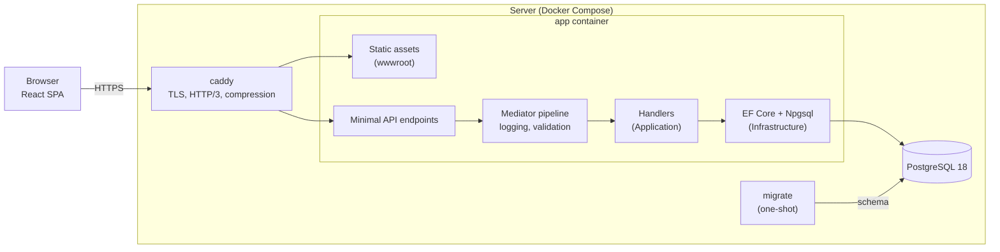

# Architecture

This document describes how Cadence is built today. The plan for what comes next is in the [roadmap](ROADMAP.md), and the reasoning behind each major choice is in the [ADRs](adr/README.md).

## System overview

Cadence is a **modular monolith** ([ADR-0002](adr/0002-modular-monolith-with-clean-architecture.md)) deployed as **one application container** that serves both the REST API and the compiled React app ([ADR-0004](adr/0004-single-container-serves-the-spa.md)). PostgreSQL is the only other stateful component ([ADR-0003](adr/0003-postgresql.md)).



## Backend

### Layers

| Project | Responsibility | May depend on |
|---|---|---|
| `Cadence.Domain` | Entities, aggregates, value objects, domain events, `Result`/`Error` | nothing |
| `Cadence.Application` | Commands and queries, handlers, validators, pipeline behaviors, abstractions such as `IApplicationInfo` | Domain |
| `Cadence.Infrastructure` | `CadenceDbContext`, migrations, database configuration and diagnostics; ASP.NET Core Identity, token issuing, email delivery and the membership cache | Application |
| `Cadence.Api` | Endpoints, error handling, versioning, OpenAPI, SPA hosting, composition root | all of the above |
| `Cadence.ServiceDefaults` | Health checks and opt-in OpenTelemetry | — |
| `Cadence.Migrator` | Applies migrations, then exits ([ADR-0015](adr/0015-one-shot-migrator.md)) | Infrastructure |
| `Cadence.AppHost` | Aspire orchestration for local development only | — |

`tests/Cadence.ArchitectureTests` enforces these rules on every build.

### Anatomy of a request

`GET /api/v1/system/info`:

1. **Caddy** terminates TLS and forwards the request to `app:8080`. Forwarded headers are trusted, so the app sees the real scheme and client IP.
2. **Routing**: the endpoint lives in a versioned route group (`/api/v{version}`, Asp.Versioning). Responses advertise `api-supported-versions`.
3. **Endpoint** (`SystemEndpoints`): a static handler that sends `GetSystemInfoQuery` through `ISender`.
4. **Pipeline**: `LoggingBehavior` times the request and warns when it takes 500 ms or more. `ValidationBehavior` runs FluentValidation validators, if there are any, and throws a `ValidationException` with every failure.
5. **Handler** (`GetSystemInfoQueryHandler`): pure application logic, using injected abstractions (`IApplicationInfo`, `TimeProvider`).
6. **Response**: `TypedResults.Ok(...)`, serialized with the source-generated `ApiJsonSerializerContext`.

The mediator and all handler registrations are generated at compile time ([ADR-0005](adr/0005-no-reflection-on-hot-paths.md)).

### Errors

- **Expected failures** (not found, conflict, forbidden) are returned as `Result`/`Error` values from the domain and application layers. Each `ErrorType` maps to one HTTP status code.
- **Validation failures** become `400` responses in the standard validation problem details shape, with errors grouped by camelCase field name.
- **Unexpected exceptions** become `500` problem details. Every problem response includes `instance` and a `traceId` that correlates with logs and traces.
- Unknown `/api/*` routes return a JSON `404`, never the SPA.

### Persistence

- `CadenceDbContext` is **pooled** (32 instances). Contexts are reused across requests instead of being rebuilt each time.
- A shared `NpgsqlDataSource` caps connections at **20** unless the connection string sets its own limit. PostgreSQL allows 25, which leaves room for the migrator and admin sessions.
- Identifiers are `snake_case`. Primary keys are UUIDv7 ([ADR-0011](adr/0011-uuidv7-primary-keys.md)).
- **Interceptors are resolved from DI.** `SlowQueryInterceptor` logs commands over 50 ms (configurable). Tests plug in a `QueryCounter` the same way, to enforce query budgets.
- Migrations live in `Infrastructure/Persistence/Migrations` and are authored with `dotnet ef migrations add <Name> --project src/Cadence.Infrastructure`.

### Health and telemetry

- `/health/live` means the process responds. It never touches the database.
- `/health/ready` means dependencies (PostgreSQL) are reachable. It returns `503` when they aren't.
- OpenTelemetry tracing, metrics and log export switch on **only when `OTEL_EXPORTER_OTLP_ENDPOINT` is set**. Aspire sets it in development, and production leaves it off by default.
- Logs are structured JSON in production and plain text in development. Log messages use `[LoggerMessage]` source generation.

### Authentication

Details and trade-offs are in [ADR-0006](adr/0006-jwt-access-tokens-and-rotating-refresh-tokens.md).

- **Accounts** use ASP.NET Core Identity (PBKDF2 hashing, lockout, security stamps). Registration requires a confirmed email by default (`Cadence:Auth:RequireConfirmedEmail`), and self-registration can be switched off (`AllowRegistration`).
- **Access tokens** are 10-minute HMAC-SHA256 JWTs, validated statelessly: authenticating a request costs no database or cache lookup.
- **Refresh tokens** live in the `cadence_refresh` cookie (`HttpOnly`, `SameSite=Strict`, scoped to `/api/v1/auth`). Only their SHA-256 hash is stored. Each refresh rotates the token within its family; replaying an exchanged token revokes the family.
- **Rate limits** are 10 requests per minute per IP on sign-in, registration and password endpoints, 60 per minute on refresh, and a 600-per-minute token bucket per user (or per IP when anonymous) on the rest of the API. Rejections are `429` problem details with `Retry-After`.

### Multi-tenancy

Everything a team owns belongs to an **organization**. Details are in [ADR-0007](adr/0007-tenant-isolation.md).

1. Organization routes have the shape `/api/v1/organizations/{organizationId}/…`. `TenantResolutionMiddleware` loads the caller's membership from the **HybridCache membership cache** and binds the request to the organization (`ITenantContext`). Non-members get `404`, exactly like a missing organization.
2. Endpoints declare what they need with `.RequirePermission(Permissions.X)`. The permission policy reads the cached membership, so authorization makes **0 database queries** on the hot path. One role → permission matrix in the domain defines Owner, Admin, Member and Guest.
3. Every `ITenantScoped` entity has a named EF Core query filter that limits it to the resolved organization, and matches nothing when no organization is resolved. Cross-tenant queries (for example "my organizations") opt out explicitly with `IgnoreQueryFilters([QueryFilters.Tenant])`.
4. `SaveChanges` refuses to write another organization's rows while a tenant is resolved, as defense in depth.

Membership changes invalidate the cache immediately, so a removed member loses access on their next request.

### Email

Handlers queue messages on a bounded in-process channel, and `EmailDispatcher` (a background service) sends them over SMTP with MailKit, so requests never wait for the mail server. Without an SMTP host, emails are logged and dropped. Links point at `Cadence:PublicUrl`. The queue is in memory for now; M8 moves it onto a durable outbox.

## Frontend

`web/` is a React 19 + TypeScript app built with Vite. Code is organized by feature:

```
web/src/
  app/        shell: providers, router, layouts, error boundary
  features/   one folder per feature (auth, organizations, settings, home), each with a public index.ts
  shared/     api (client + generated hooks), auth (session), workspace (current organization),
              theme (light / dark / system), ui (the component kit), forms, lib
  test/       Vitest setup, MSW server, render helpers
```

ESLint enforces the boundaries:
- `app` imports features only through their public index, or a single route page so each page gets its own chunk
- features import only themselves and `shared`
- `shared` imports only `shared`

The rules are generated per feature folder, so new features are covered automatically.

- **Server state**: TanStack Query hooks generated by Orval from the committed OpenAPI document ([ADR-0014](adr/0014-committed-openapi-contract-and-generated-client.md)). A single `httpClient` turns problem details into a typed `ApiError`. 4xx errors are not retried, and window-focus refetching is off (live updates will arrive over SignalR).
- **Routing**: React Router, with each page lazy-loaded into its own chunk. `RequireAuth` sends visitors to sign in with a `returnTo`, and organization pages live under `/:orgSlug`.
- **Session**: the access token lives only in memory (`shared/auth`). On load, and shortly before the token expires, the client exchanges the refresh cookie for a new token. Parallel refreshes are deduplicated in the tab and serialized across tabs with the Web Locks API, and a `401` triggers one refresh and a retry.
- **Forms**: react-hook-form with `zod/mini` schemas that mirror the server rules. Server validation errors are mapped back onto the fields.
- **Rendering**: the React Compiler memoizes components automatically.
- **Design system** ([ADR-0016](adr/0016-brand-and-design-system.md)): the tokens in `design/tokens.css` are mirrored in `src/index.css` and exposed to Tailwind CSS v4 by semantic name (`bg-card`, `text-muted-foreground`, `bg-status-done`…). Components never use palette colors. `shared/ui` holds the kit (Radix primitives styled to design board 05), and `/style-guide` shows every component in both themes in development builds.
- **Themes**: `<html data-theme="light|dark">`. A seven-line inline script applies the saved choice before the first paint, and `shared/theme` keeps it in sync with the OS and other tabs. The choice (system, light, dark) is stored per browser.
- **Fonts**: Geist and Geist Mono from `@fontsource-variable`, served from the app's own origin. Only the Latin files download for English text (51 KB). The Latin Geist file is preloaded, and metric-matched fallbacks keep the layout from shifting while it loads.
- **Testing**:
  - unit and component tests with Vitest (jsdom), Testing Library and Mock Service Worker; requests without a handler fail the test
  - the visual suite (`web/visual`): a screenshot of each key page in both themes against committed Linux baselines, plus an axe scan, with the API mocked in the browser
  - end-to-end journeys (`web/e2e`) against the production stack

## Development environment

`dotnet run --project src/Cadence.AppHost` starts everything:
- PostgreSQL 18, in a persistent container with a named volume
- Mailpit
- the migrator
- the API, reported healthy once `/health/ready` passes
- the Vite dev server, once the API is healthy

Vite proxies `/api`, `/health` and `/hubs` to the API through Aspire service discovery, so development uses a single origin just as production does. The Aspire dashboard shows logs, traces and metrics for every resource.

## Build and delivery

- The multi-stage `Dockerfile` builds the SPA and cross-compiles the .NET app for the target architecture on the build machine's native platform. The final stage is a chiseled, non-root ASP.NET image, so multi-arch builds need no emulation.
- **CI** (`.github/workflows/ci.yml`) runs on every pull request:
  - **Backend**: format, build (warnings are errors), OpenAPI drift check, and unit, integration and architecture tests.
  - **Frontend**: client drift check, lint, format check, type-check, tests, build and bundle budgets.
  - **Container**, on both amd64 and arm64: build the image, start the production stack, run the smoke tests, a memory check at idle, a 10-user k6 load test, and a memory check after load. On amd64 it then runs the **Playwright end-to-end tests** against the same stack, with Mailpit catching email (`deploy/docker-compose.e2e.yml`).
  - **Visual & accessibility**: the visual suite, in the Playwright container image its baselines were rendered in.
- **Release** (`.github/workflows/release.yml`): a `vX.Y.Z` tag publishes multi-arch images with provenance and an SBOM to `ghcr.io/norman135/cadence`, and creates a GitHub release.
