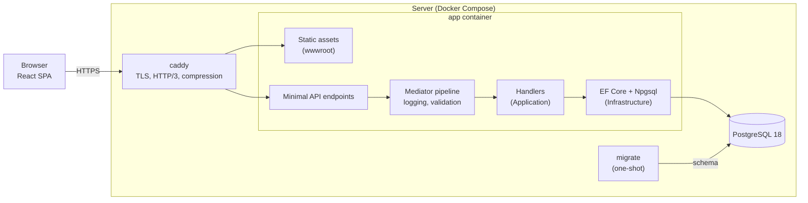

# Architecture

This document describes how Cadence is built today. The plan for what comes next is in the [roadmap](ROADMAP.md), and the reasoning behind each major choice is in the [ADRs](adr/README.md).

## System overview

Cadence is a **modular monolith** ([ADR-0002](adr/0002-modular-monolith-with-clean-architecture.md)) deployed as **one application container** that serves both the REST API and the compiled React app ([ADR-0004](adr/0004-single-container-serves-the-spa.md)). PostgreSQL is the only other stateful component ([ADR-0003](adr/0003-postgresql.md)).



## Backend

### Layers

| Project | Responsibility | May depend on |
|---|---|---|
| `Cadence.Domain` | Entities, aggregates, value objects, domain events, `Result`/`Error` | nothing |
| `Cadence.Application` | Commands and queries, handlers, validators, pipeline behaviors, abstractions such as `IApplicationInfo` | Domain |
| `Cadence.Infrastructure` | `CadenceDbContext`, migrations, database configuration and diagnostics | Application |
| `Cadence.Api` | Endpoints, error handling, versioning, OpenAPI, SPA hosting, composition root | all of the above |
| `Cadence.ServiceDefaults` | Health checks and opt-in OpenTelemetry | — |
| `Cadence.Migrator` | Applies migrations, then exits ([ADR-0015](adr/0015-one-shot-migrator.md)) | Infrastructure |
| `Cadence.AppHost` | Aspire orchestration for local development only | — |

`tests/Cadence.ArchitectureTests` enforces these rules on every build.

### Anatomy of a request

`GET /api/v1/system/info`:

1. **Caddy** terminates TLS and forwards the request to `app:8080`. Forwarded headers are trusted, so the app sees the real scheme and client IP.
2. **Routing**: the endpoint lives in a versioned route group (`/api/v{version}`, Asp.Versioning). Responses advertise `api-supported-versions`.
3. **Endpoint** (`SystemEndpoints`): a static handler that sends `GetSystemInfoQuery` through `ISender`.
4. **Pipeline**: `LoggingBehavior` times the request and warns when it takes 500 ms or more. `ValidationBehavior` runs FluentValidation validators, if there are any, and throws a `ValidationException` with every failure.
5. **Handler** (`GetSystemInfoQueryHandler`): pure application logic, using injected abstractions (`IApplicationInfo`, `TimeProvider`).
6. **Response**: `TypedResults.Ok(...)`, serialized with the source-generated `ApiJsonSerializerContext`.

The mediator and all handler registrations are generated at compile time ([ADR-0005](adr/0005-no-reflection-on-hot-paths.md)).

### Errors

- **Expected failures** (not found, conflict, forbidden) are returned as `Result`/`Error` values from the domain and application layers. Each `ErrorType` maps to one HTTP status code.
- **Validation failures** become `400` responses in the standard validation problem details shape, with errors grouped by camelCase field name.
- **Unexpected exceptions** become `500` problem details. Every problem response includes `instance` and a `traceId` that correlates with logs and traces.
- Unknown `/api/*` routes return a JSON `404`, never the SPA.

### Persistence

- `CadenceDbContext` is **pooled** (32 instances). Contexts are reused across requests instead of being rebuilt each time.
- A shared `NpgsqlDataSource` caps connections at **20** unless the connection string sets its own limit. PostgreSQL allows 25, which leaves room for the migrator and admin sessions.
- Identifiers are `snake_case`. Primary keys are UUIDv7 ([ADR-0011](adr/0011-uuidv7-primary-keys.md)).
- **Interceptors are resolved from DI.** `SlowQueryInterceptor` logs commands over 50 ms (configurable). Tests plug in a `QueryCounter` the same way, to enforce query budgets.
- Migrations live in `Infrastructure/Persistence/Migrations` and are authored with `dotnet ef migrations add <Name> --project src/Cadence.Infrastructure`.

### Health and telemetry

- `/health/live` means the process responds. It never touches the database.
- `/health/ready` means dependencies (PostgreSQL) are reachable. It returns `503` when they aren't.
- OpenTelemetry tracing, metrics and log export switch on **only when `OTEL_EXPORTER_OTLP_ENDPOINT` is set**. Aspire sets it in development, and production leaves it off by default.
- Logs are structured JSON in production and plain text in development. Log messages use `[LoggerMessage]` source generation.

## Frontend

`web/` is a React 19 + TypeScript app built with Vite. Code is organized by feature:

```
web/src/
  app/        shell: providers, router, layouts, error boundary
  features/   one folder per feature (home, …), each with a public index.ts
  shared/     api (client + generated hooks), ui (design system), lib
  test/       Vitest setup, MSW server, render helpers
```

ESLint enforces the boundaries:
- `app` imports features only through their public index
- features import only themselves and `shared`
- `shared` imports only `shared`

The rules are generated per feature folder, so new features are covered automatically.

- **Server state**: TanStack Query hooks generated by Orval from the committed OpenAPI document ([ADR-0014](adr/0014-committed-openapi-contract-and-generated-client.md)). A single `httpClient` turns problem details into a typed `ApiError`. 4xx errors are not retried, and window-focus refetching is off (live updates will arrive over SignalR).
- **Routing**: React Router, with each feature page lazy-loaded into its own chunk.
- **Rendering**: the React Compiler memoizes components automatically.
- **Styling**: Tailwind CSS v4 with semantic OKLCH design tokens (light and dark follow the OS), and shadcn/ui-style components in `shared/ui`.
- **Testing**: Vitest (jsdom), Testing Library and Mock Service Worker. Requests without a handler fail the test.

## Development environment

`dotnet run --project src/Cadence.AppHost` starts everything:
- PostgreSQL 18, in a persistent container with a named volume
- Mailpit
- the migrator
- the API, reported healthy once `/health/ready` passes
- the Vite dev server, once the API is healthy

Vite proxies `/api`, `/health` and `/hubs` to the API through Aspire service discovery, so development uses a single origin just as production does. The Aspire dashboard shows logs, traces and metrics for every resource.

## Build and delivery

- The multi-stage `Dockerfile` builds the SPA and cross-compiles the .NET app for the target architecture on the build machine's native platform. The final stage is a chiseled, non-root ASP.NET image, so multi-arch builds need no emulation.
- **CI** (`.github/workflows/ci.yml`) runs on every pull request:
  - **Backend**: format, build (warnings are errors), OpenAPI drift check, and unit, integration and architecture tests.
  - **Frontend**: client drift check, lint, format check, type-check, tests, build and bundle budgets.
  - **Container**, on both amd64 and arm64: build the image, start the production stack, run the smoke tests, a memory check at idle, a 10-user k6 load test, and a memory check after load.
- **Release** (`.github/workflows/release.yml`): a `vX.Y.Z` tag publishes multi-arch images with provenance and an SBOM to `ghcr.io/norman135/cadence`, and creates a GitHub release.
